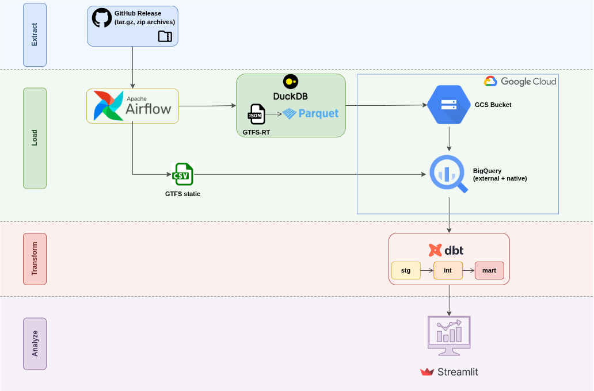

# AMTAB Bari - GTFS ELT Pipeline

> Data Engineering Zoomcamp 2026 — Final Project

## Project Description

[AMTAB](https://www.amtab.it/en) is the public transit company serving Bari, 
Italy. 

Buses frequently run late or early; therefore, the project goal is to build a 
pipeline that ingests transit data provided by AMTAB through their real-time API 
based on the [GTFS](http://gtfs.org) specification and compares it against the 
published schedule to compute **On-Time Performance (OTP)** - the percentage of 
stops served within an acceptable delay window (between -1 and +5 minutes).

The resulting dashboard lets transit planners identify the worst-performing
routes and track OTP trends over time.

## Architecture

The pipeline architecture is shown below:



## Dataset

### GTFS-RT (Real-Time)

Historical GTFS-RT snapshots were collected from AMTAB's real-time feed at
~30-second intervals. The collection script was run at specific periods of the
day, so the dataset doesn't cover the full 24-hour service window.

The GTFS-RT specification has two entity types:

- **TripUpdate** which stores delay information per trip and stop 
(arrival/departure delay in minutes)
- **VehiclePosition** which stores the GPS coordinates, speed, and current stop
for each active bus.

The dataset covers the period from June 2025 to March 2026. This project uses
October to December 2025. 

Data is stored as Hive-partitioned JSON files (format `dt=YYYY-MM-DD/hour=HH/`) 
and distributed as monthly tar.gz archives via GitHub Releases.

### GTFS Static

The GTFS static archive contains scheduled data from AMTAB: routes, stops,
trips, stop times, calendar, shapes, and feed info. 

It is distributed as a zip of CSV files and updated annually in December. 

The 2025 archive is used to match the real-time data period.

## Pipeline Software Components

| Component | Tool | Purpose |
|-----------|------|---------|
| IaC | Terraform | Provision GCS bucket, BigQuery dataset, service account |
| Orchestration | Airflow 3 | Schedule and monitor pipeline DAGs |
| Data Lake | GCS | Store processed Parquet files |
| Raw Archive | GitHub Releases | Immutable storage for original JSON and static GTFS archives |
| Warehouse | BigQuery | Analytical queries via external and native tables |
| Transformation | dbt | SQL models (staging, intermediate, mart) |
| Data Quality | dbt tests + dbt utils | Not-null, uniqueness, range, and deduplication checks |
| Dashboard | Streamlit | Visualize OTP metrics with Plotly charts |
| Processing | DuckDB | JSON to Parquet conversion inside Airflow tasks |
| Package Management | uv | Python dependency management and virtual environment |

## Setup Instructions

### Prerequisites

- GCP account
- Terraform >= 1.0
- Docker and Docker Compose v2.14+
- Python 3.12+
- [uv](https://docs.astral.sh/uv/)

### 1. Initial setup

Clone the repository and install Python dependencies:

```bash
git clone https://github.com/mikiab/amtab-elt.git
cd amtab-elt
uv sync
```

### 2. Terraform

Terraform provisions the GCS bucket, BigQuery dataset, service account, and SA 
key.

```bash
cd terraform
cp terraform.tfvars.example terraform.tfvars
# Edit terraform.tfvars with your GCP project ID
terraform init
terraform apply
```

The SA key is written to `keys/sa-key.json`.

**NOTE:** The files in the `keys` folder are git ignored for security reasons.

### 3. Airflow

Airflow is used to orchestrate the pipeline and it's executed locally via 
Docker Compose.

```bash
cd airflow
cp .env.example .env
# Edit .env with your bucket name and GitHub Release URL
# The release URL is: https://github.com/mikiab/amtab-elt/releases/download/v0.1-data
docker compose up -d
```

Airflow provides a web UI available at `http://localhost:8080` to launch and 
monitor DAGs. (username: `airflow`, password: `airflow`).

### 4. Run DAGs

In the Airflow UI, perform the following actions:

- **Enable and trigger `ingest_and_convert`** to download GTFS-RT archives from
GitHub, convert JSON to Parquet via DuckDB and upload to GCS.
- **Trigger `create_external_tables`** to create BigQuery *external tables* 
pointing to the Parquet files in GCS.
- **Trigger `load_gtfs_static`** to download the GTFS static archive from 
GitHub, extract and load CSVs into BigQuery. 

The last two DAGs are not scheduled but run once.

### 5. dbt

```bash
cd dbt
export GCP_PROJECT_ID=your-project-id
export GOOGLE_APPLICATION_CREDENTIALS=../keys/sa-key.json
uv run dbt deps
uv run dbt build
uv run dbt docs generate 
uv run dbt docs serve
```

### 6. Dashboard

```bash
cd streamlit
export GCP_PROJECT_ID=your-project-id
export GOOGLE_APPLICATION_CREDENTIALS=../keys/sa-key.json
uv run streamlit run app.py
```

## dbt Lineage


## Data Quality

The project ensures **data quality** in all models at different layers: staging,
intermediate and mart. 

The checks for the *staging* models include:
- Not null keys,
- Accepted values for the delay, latitude, longitude and speed columns,
- Warning message in the case of *duplicates*.

The checks for the *intermediate* models include:
- **Deduplications** to allow only one observation per trip/stop/day,
- Filtering trips with null delay,
- **Uniqueness** on composite key.

The checks for the *mart* model include:
- **Uniqueness** on composite key.

## Partitioning & Clustering

The `mart_otp_summary` table is **partitioned by date** and **clustered by 
route**.

The dashboard's primary interaction is a date range picker. Partitioning by date 
means BigQuery only scans the date range the user selected, not the entire table. 

With some months of daily data across multiple routes, this reduces query costs 
and latency.

Furthermore, within a date partition, the most common filter is by **route**. 
**Clustering** physically co-locates rows for the same route, so queries that 
filter by route read fewer bytes and the Streamlit dashboard benefits from this.

The BigQuery mart table uses an **incremental strategy** to overwrite the entire
partitions on each dbt run, preventing duplicates without row-level merging.

## BigQuery Table Strategy

Real-time data (TripUpdate, VehiclePosition) is stored as Parquet on GCS and
exposed via **external tables**. External tables avoid data duplication — dbt
reads from GCS directly. Since only dbt queries these tables (not the
dashboard), the lack of caching is acceptable.

Static GTFS data (routes, stops, stop_times, etc.) is loaded as **native
tables** with `WRITE_TRUNCATE`. These are small (~MB), rarely change, and
benefit from BigQuery's columnar storage and caching.

## Dashboard


## License

BSD-2-Clause. See [LICENSE](LICENSE).
